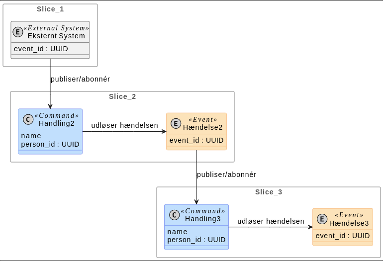

# PlantUML for Event Modeling

This repository provides a simple yet powerful PlantUML **style library** to create diagrams using the **Event Modeling** methodology. The goal is to enable teams to quickly and consistently visualize system behavior as a chronological storyboard, focusing on the flow of information over time.

This library is inspired by the work of [Adam Dymitruk](https://eventmodeling.org/) and the clear, step-by-step examples from [Martin Dilger](https://www.linkedin.com/in/martindilger/).

## Overview

Event Modeling is a method of describing a system by illustrating the flow of information through it. It visualizes the entire system on a single diagram, making it a powerful tool for collaboration between business stakeholders and technical teams.

This PlantUML library provides styles and pre-defined color variables to easily create the core building blocks of an Event Model using standard PlantUML syntax.



## Core Building Blocks

The `styling.puml` library file defines styles and color variables for the essential elements of an Event Model. You create elements using standard `class` or `agent` syntax and apply the correct stereotype.

  * **Slice** (Gray Package): A container for a chronological slice.
      * **Syntax**: `package "Slice Name" { ... }`
  * **Trigger** (White ⚪): Represents a UI, API, or user action.
      * **Syntax**: `class "Registration Form" <<Trigger>>`
  * **Command** (Blue 🔵): An intention to change the state of the system.
      * **Syntax**: `class "Register User" <<Command>>`
  * **Event** (Orange 🟠): A factual record of something that has happened. This is the source of truth.
      * **Syntax**: `class "User Registered" <<Event>>`
  * **Read Model** (Green 🟢): A projection or query tailored for a specific view.
      * **Syntax**: ` class "User Profile" <<"Read Model">>  ` (Note the quotes)
  * **Automation** (White ⚪): A system-driven, automated process.
      * **Syntax**: `class "Send Email" <<Automation>>`
  * **Policy** (Purple 🟣): A business rule or policy that processes events.
      * **Syntax**: `agent "Email Policy" <<Policy>>`
  * **External System** (Gray 🌫️): A third-party system or integration.
      * **Syntax**: ` class "Payment Gateway" <<"External System">>  ` (Note the quotes)

## How to Use

1.  **Clone or Download the Repository**: Get the `styling.puml` file and the example `.puml` files.
    ```bash
    git clone https://github.com/your-username/your-repo-name.git
    ```
2.  **Include the Library**: At the top of your PlantUML diagram file, add the following line to include the styles and color variables:
    ```plantuml
    !include styling.puml
    ```
3.  **Generate Diagrams**: Use a local PlantUML installation or an online tool to render your `.puml` files into images. See the "Offline Rendering" section below for a recommended local setup.

## Creating Your Own Event Models

This library uses standard PlantUML syntax, enhanced with two key concepts: **Stereotypes** for box colors and **Spot Stereotypes** for the corner icons.

### 1\. Adding Elements and Slices

Define elements using `class` and group them into `package` slices. The styles are applied automatically based on the stereotype.

```plantuml
@startuml
!include styling.puml

' A slice is just a standard package
package "Slice 1: Register User" {
  ' The stereotype <<Command>> automatically colors the box blue
  class RegisterUser <<Command>> {
    username: string
  }

  ' The stereotype <<Event>> automatically colors the box orange
  class UserRegistered <<Event>> {
    userId: UUID
  }
}
@enduml
```

### 2\. Using Spot Stereotypes (The "Circled Letter" Icon)

To get the circled 'E' for Events or 'C' for Commands, you must add them manually. This library is designed for this method.

1.  **Hide the Default Icon**: The `styling.puml` file already includes `skinparam classStereotypeIcon false` to hide PlantUML's default (and unchangeable) 'C' icon.
2.  **Add a Manual Spot**: Add `<<(Letter)>>` to your class definition.
3.  **Color the Spot**: Add the color *inline* using one of the pre-defined variables from `styling.puml` (e.g., `$EM_EVENT_BORDER`).

This gives you full control over the icon's letter and color, while keeping the color definition centralized in the style file.

```plantuml
package "Slice 2: With Spots" {
  ' Syntax: <<(Letter, $ColorVariable), Stereotype>>
  class Handling2 <<(C, $EM_COMMAND_BORDER), Command>> {
    name
  }

  class Hændelse2 <<(E, $EM_EVENT_BORDER), Event>>{
    event_id
  }
}
```

### 3\. Defining Information Flow

Use standard PlantUML arrows (`->`, `-->`, etc.) to show the flow of information between elements.

```plantuml
' A command is handled and produces an event
Handling2 -right-> Hændelse2 : udløser hændelsen
```

## Complete Example

This example demonstrates the full syntax for creating a multi-slice event model.

```plantuml
@startuml Example Event Model
!include styling.puml

skinparam packageStyle rectangle

package "Slice 1" {
  class "Eksternt System" <<(E, $EM_SYSTEM_BORDER), "External System">> {
    event_id : UUID
  }
}

package "Slice 2" {
  "Eksternt System" -down-> Handling2 : publiser/abonnér
  
  ' Spot <<(C)>> is colored with the $EM_COMMAND_BORDER variable
  class Handling2 <<(C, $EM_COMMAND_BORDER), Command>> {
    name
    person_id : UUID
  }
  
  ' Spot <<(E)>> is colored with the $EM_EVENT_BORDER variable
  class Hændelse2 <<(E, $EM_EVENT_BORDER), Event>>{
    event_id : UUID
  }
}

package "Slice 3" {
  Hændelse2 -down-> Handling3 : publiser/abonnér
  Handling2 -right-> Hændelse2 : udløser hændelsen
  
  class Handling3 <<(C, $EM_COMMAND_BORDER), Command>> {
    name
    person_id : UUID
  }
  Handling3 -right-> Hændelse3 : udløser hændelsen
  
  class Hændelse3 <<(E, $EM_EVENT_BORDER), Event>>{
    event_id : UUID
  }
}
@enduml
```

## Steps to Render Diagrams in VSCode with Full Offline Setup

If using online rendering tools isn't an option, here's how you can ensure that your diagrams render correctly in VSCode using the **PlantUML** extension.

1.  **Install PlantUML Extension in VSCode**:

      * Open VSCode and go to the Extensions view (`Ctrl+Shift+X` or `Cmd+Shift+X` on Mac).
      * Search for "PlantUML" and install the extension by **jebbs**.

2.  **Install Java**:

      * The PlantUML extension requires **Java** to run locally.
      * Download and install a Java Development Kit (JDK), version 8 or higher.

3.  **Install Graphviz**:

      * Graphviz is required for PlantUML to render complex diagrams.
      * You can download Graphviz from its [official site](https://graphviz.gitlab.io/download/).

4.  **Configure PlantUML Extension Settings**:

      * Open VSCode settings (`Ctrl+,` or `Cmd+,` on Mac).
      * Search for `PlantUML` in the settings.
      * Ensure that `plantuml.render` is set to `Local`. This will tell VSCode to use the local Java and Graphviz installations.

5.  **Render Diagrams in VSCode**:

      * Open your `.puml` file in VSCode.
      * To view a live preview of the diagram, press `Alt+D` (`Option+D` on Mac).

## License

This project is available for use under the [MIT License](https://www.google.com/search?q=LICENSE).
